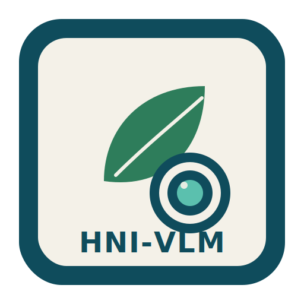
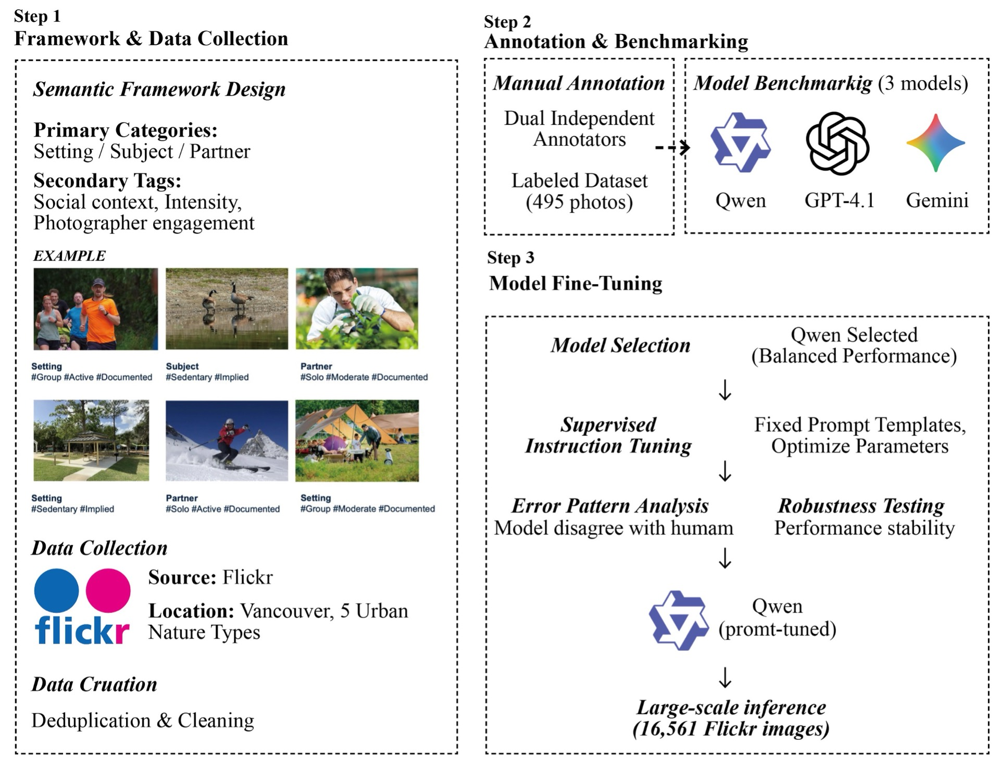
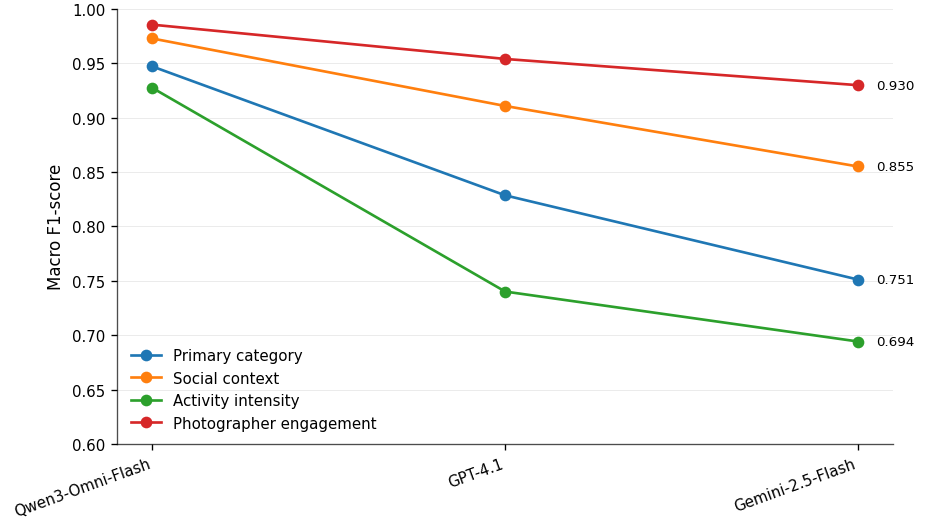

<div align="center">



# HNI-VLM
### Vision-Language Models for Human–Nature Interaction Classification

[](https://opensource.org/licenses/MIT)
[](https://www.python.org/)
[](https://colab.research.google.com/github/LabMingzeChen/HNI-VLM/blob/main/examples/01_quickstart.ipynb)
[](https://huggingface.co/spaces/Mingze/HNI-VLM)

**Move beyond activity recognition. Understand *how* people relate to nature in images.**

[**📖 Documentation**](docs/) • [**🚀 Quick Start**](#-quick-start) • [**🎯 Live Demo**](#-live-demo) • [**📊 Benchmark**](#-benchmark) • [**📄 Paper**](#-citation)

</div>

---

## 🌿 What is HNI-VLM?

**HNI-VLM** is the first open-source toolkit for classifying **Human–Nature Interaction (HNI)** from images using Vision-Language Models. Unlike conventional object-detection pipelines (e.g. YOLO, ResNet) that only tell you *what is in a scene*, HNI-VLM tells you **the functional role nature plays in the interaction**:

| Role | Meaning | Example |
|------|---------|---------|
| 🏞️ **Setting** | Nature is the backdrop for an unrelated activity | Jogging on a park path |
| 🌳 **Subject** | Nature is the focus of attention | Landscape photography, wildlife watching |
| 🌱 **Partner** | People physically interact with nature | Gardening, climbing, swimming in a lake |

On top of the primary category, HNI-VLM jointly predicts three **secondary tags** per image: `social_context`, `activity_intensity`, and `photographer_engagement` — yielding a compositional, planning-relevant description in a single API call.

<p align="center">
  
</p>

---

## ✨ Why use this toolkit?

- ⚡ **3 lines of code** to classify an image — no model weights to download.
- 🧠 **Prompt-tuned**, not fine-tuned: works with any frontier VLM (Qwen, GPT-4, Gemini, Claude).
- 🧪 **Benchmarked** on 495 human-annotated images with two-annotator gold-standard labels.
- 🏙️ **Built for planning research**: outputs map directly to urban-design decision categories.
- 📊 **Reproducible**: full evaluation pipeline included (accuracy, macro-F1, joint exact-match).
- 🔌 **Pluggable backends**: add a new VLM by subclassing `BaseVLM`.

---

## 🚀 Quick Start

### Install

```bash
pip install hni-vlm
```

Or, from source:

```bash
git clone https://github.com/YOUR_USERNAME/HNI-VLM.git
cd HNI-VLM
pip install -e .
```

### Set your API key

HNI-VLM currently ships with a Qwen backend (recommended — the best-performing model in our benchmark). Get a free DashScope key at [dashscope.aliyun.com](https://dashscope.aliyun.com/).

```bash
# Linux / macOS
export DASHSCOPE_API_KEY="sk-..."

# Windows (PowerShell)
$env:DASHSCOPE_API_KEY="sk-..."
```

### Classify an image

```python
from hni_vlm import HNIClassifier

model  = HNIClassifier(backend="qwen")
result = model.predict("park.jpg")

print(result.primary_category)         # 'setting'
print(result.social_context)           # 'group'
print(result.activity_intensity)       # 'moderate'
print(result.photographer_engagement)  # 'implied'
```

That's it. URLs, local paths, PIL Images, and raw bytes all work as input.

### Batch processing

```python
urls = ["https://flickr.com/img1.jpg", "img2.jpg", "img3.jpg"]
results = model.predict_batch(urls)

import pandas as pd
df = pd.DataFrame([r.to_dict() for r in results])
df.to_csv("hni_predictions.csv", index=False)
```

### Evaluate against human labels

```python
from hni_vlm import evaluate_predictions

summary = evaluate_predictions(
    csv_path="predictions_vs_human.csv",
    output_csv="metrics_summary.csv",
)
print(summary)
```

---

## 📊 Benchmark

Performance on a **495-image gold-standard dataset** (two-annotator consensus, Flickr images from Vancouver, 2014–2023). All three models use the same definition-grounded prompts.

### Per-task macro-F1

| Task | **Qwen3-Omni-Flash** | GPT-4.1 | Gemini-2.5-Flash |
|---|:---:|:---:|:---:|
| Primary HNI (Setting/Subject/Partner) | **0.947** | 0.871 | 0.815 |
| Social context (solo/group/NA)        | **0.973** | 0.918 | 0.873 |
| Activity intensity                    | **0.927** | 0.852 | 0.789 |
| Photographer engagement               | **0.985** | 0.951 | 0.912 |

### Overall accuracy

| Metric | **Qwen3-Omni-Flash** | GPT-4.1 | Gemini-2.5-Flash |
|---|:---:|:---:|:---:|
| Label-wise average accuracy           | **0.972** | 0.911 | 0.869 |
| Joint (exact-match, all-4-correct) accuracy | **0.903** | 0.760 | 0.683 |

Inter-annotator agreement (Cohen's κ) on the gold dataset: `primary=0.853`, `engagement=0.860`, `social=0.684`, `intensity=0.569`.

<p align="center">
  
</p>

---

## 🎯 Live Demo

Try it in your browser — no install needed:

- 🤗 **[Hugging Face Space](https://huggingface.co/spaces/Mingze/HNI-VLM)** — upload an image, get all four labels.
- 📓 **[Colab Notebook](https://colab.research.google.com/github/LabMingzeChen/HNI-VLM/blob/main/examples/01_quickstart.ipynb)** — full pipeline in 30 seconds.

---

## 📚 Examples

| Notebook | What it shows |
|---|---|
| [`01_quickstart.ipynb`](examples/01_quickstart.ipynb) | Single image → 4 labels in 3 lines |
| [`02_batch_inference.ipynb`](examples/02_batch_inference.ipynb) | Process a CSV of image URLs with resume support |
| [`03_evaluation.ipynb`](examples/03_evaluation.ipynb) | Reproduce the paper's benchmark on 495 images |

---

## 🧩 Project structure

```
HNI-VLM/
├── hni_vlm/                Core Python package
│   ├── classifier.py       Main user API: HNIClassifier
│   ├── prompts.py          Prompt-tuned templates for all tasks
│   ├── schemas.py          Typed result containers
│   ├── evaluate.py         Benchmark utilities
│   ├── models/             Pluggable VLM backends (Qwen / GPT / Gemini)
│   └── utils/              Image loading and encoding helpers
├── examples/               Tutorial notebooks
├── data/benchmark_495/     Gold-standard annotations
├── docs/                   Extended documentation
└── tests/                  Unit tests
```

---

## 🛠️ Add a new VLM backend

Subclass `BaseVLM` and implement one method:

```python
from hni_vlm.models import BaseVLM

class MyVLM(BaseVLM):
    def _call(self, image_url: str, prompt: str) -> str:
        # ... send (image_url, prompt) to your model
        return response_text

# Use it
from hni_vlm import HNIClassifier
model = HNIClassifier(backend=MyVLM(model_name="my-model"))
```

Pull requests adding GPT-4, Gemini, Claude, LLaVA, or InternVL backends are warmly welcome.

---

## 🗺️ Use cases in research and practice

- 🏙️ **Urban planning** — quantify whether parks serve as *settings*, *subjects*, or *partners* of interaction, informing design priorities.
- 🌍 **Cross-city comparison** — benchmark HNI composition across cultures and climates.
- 📈 **Temporal monitoring** — track shifts in human–nature relationships over a decade of social-media data.
- 🧪 **VLM research** — diagnose where models confuse relational vs. compositional scene structure.

---

## 📄 Citation

If you use HNI-VLM in your research, please cite:

```bibtex
@phdthesis{chen2026hni,
  title  = {Vision-Language Models for Human-Nature Interaction in Urban Environments},
  author = {Chen, Mingze},
  year   = {2026},
  school = {University of British Columbia}
}
```

---

## 🤝 Contributing

Contributions are very welcome. To get started:

1. Open an issue describing the change.
2. Fork → branch → PR.
3. Run `pytest` before submitting.

See [`CONTRIBUTING.md`](CONTRIBUTING.md) for details.

---

## 📜 License

Released under the [MIT License](LICENSE). Commercial use, modification, and redistribution are permitted with attribution.

---

## 🙏 Acknowledgements

This work was conducted as part of Mingze Chen's PhD at UBC, supervised by Dr. Keunhyun Park. We thank the Flickr open-data community and the two human annotators who produced the 495-image gold-standard dataset.

---

<div align="center">

**⭐ If you find this toolkit useful, please star the repo — it helps others discover it.**

</div>
